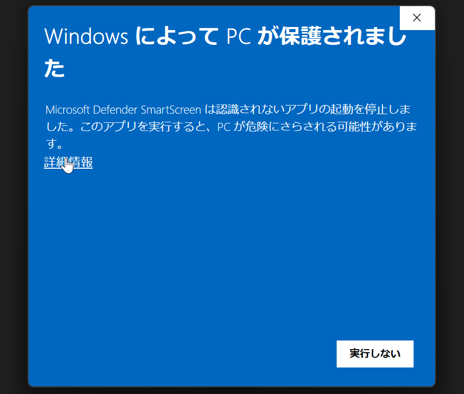
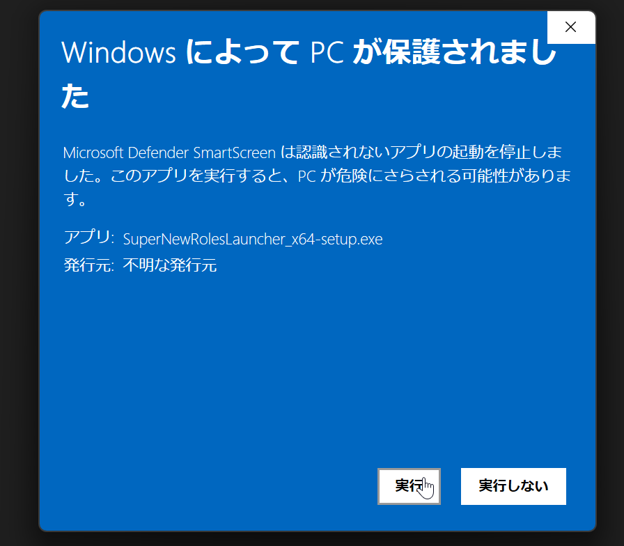

# SuperNewRolesLauncher

**AmongUs非公式Mod「[SuperNewRoles](https://supernewroles.com)」を簡単にインストール・起動できるランチャーです。**

[<kbd>   ダウンロード   </kbd>](https://github.com/SuperNewRoles/SuperNewRolesLauncher/releases/latest/download/SuperNewRolesLauncher_x64-setup.exe)
 
日本語 
[導入方法](#-導入方法) · [機能](#-機能) · [クレジット](#-クレジット)  
English 
[Installation](#-installation) · [Feature](#-features) · [Credits](#-credits) 

> [!NOTE]
> Windowsのみサポートしています。Android版は [Starlight](https://wiki.supernewroles.com/Android%E7%89%88%E3%81%AE%E3%82%A4%E3%83%B3%E3%82%B9%E3%83%88%E3%83%BC%E3%83%AB%E6%96%B9%E6%B3%95) をお使いください。

---

## 📥 導入方法

### 1. インストーラーをダウンロード

[**こちら**](https://github.com/SuperNewRoles/SuperNewRolesLauncher/releases/latest/download/SuperNewRolesLauncher_x64-setup.exe) から最新版のインストーラーをダウンロードして実行します。

### 2. Windows Defenderの警告が出た場合

「**詳細情報**」をクリック → 「**実行**」を押してください。

| 詳細情報をクリック | 実行をクリック |
|:---:|:---:|
|  |  |

### 3. インストーラーの指示に従う

基本的に全て「**次へ**」をクリックすれば問題ありません。

### 4. SuperNewRolesをセットアップ

SuperNewRoles Launcherが起動したら、画面の指示に沿ってSuperNewRolesをインストールしてください。

> [!TIP]
> 既にSuperNewRolesを導入している場合は、「**既存データの取り込み**」から「**インストール済みのSuperNewRolesからデータを取り込む**」を有効にすると、設定などを引き継ぐことができます。

### 5. 起動！

「**起動**」ボタンを押すだけでSuperNewRolesがスタートします！

---

## ✨ 機能

### 🎮 SuperNewRolesの起動

Steam / Epic版のAmongUsに対して、SuperNewRolesを導入した状態で起動できます。設定からショートカットを作成すれば、ランチャーを開かずに直接起動することも可能です。

| プラットフォーム | 備考 |
|:---|:---|
| **Steam** | Steamが起動している必要があります |
| **Epic Games** | SNRLauncher内でEpic認証を行えば、Epic Games Launcherなしでもログイン済み状態で起動できます |

### 📢 報告センター

ゲーム内報告機能が使えます。新しい報告の作成や、開発者からのメッセージの確認ができます。

### 📣 アナウンス

SuperNewRolesからのお知らせがランチャー上に表示されます。

### 📋 プリセット

ゲーム内の**設定プリセット**をエクスポート/インポートできます。他のプレイヤーと設定を共有するのに便利です。

### 📦 データお引越し

SuperNewRolesに関連するデータを1つのファイルにまとめて保存・復元できます。

> [!WARNING]
> データお引越しファイルには個人データが含まれます。他のプレイヤーに渡さないでください。設定の共有には**プリセット機能**を使用してください。

---

## 🙏 クレジット

| プロジェクト | 用途 |
|:---|:---|
| [Tauri](https://github.com/tauri-apps/tauri) | アプリケーションフレームワーク |
| [Vite](https://github.com/vitejs/vite) | フロントエンド開発 |
| [All-Of-Us-Mods/Starlight-PC](https://github.com/All-Of-Us-Mods/Starlight-PC) | BepInEx分離起動 & Epicログインの参考 |

---

# English

## SuperNewRolesLauncher

**A launcher that makes it easy to install and launch [SuperNewRoles](https://supernewroles.com), an unofficial mod for Among Us.**

[<kbd>   Download   </kbd>](https://github.com/SuperNewRoles/SuperNewRolesLauncher/releases/latest/download/SuperNewRolesLauncher_x64-setup.exe)

> [!NOTE]
> Windows only. For Android, please use [Starlight](https://wiki.supernewroles.com/Android%E7%89%88%E3%81%AE%E3%82%A4%E3%83%B3%E3%82%B9%E3%83%88%E3%83%BC%E3%83%AB%E6%96%B9%E6%B3%95).

---

## 📥 Installation

### 1. Download the Installer

Download and run the latest installer from [**here**](https://github.com/SuperNewRoles/SuperNewRolesLauncher/releases/latest/download/SuperNewRolesLauncher_x64-setup.exe).

### 2. If Windows Defender shows a warning

Click "**More info**" → then click "**Run anyway**".

| Click "More info" | Click "Run anyway" |
|:---:|:---:|
|  |  |

### 3. Follow the installer instructions

Just click "**Next**" through all the steps.

### 4. Set up SuperNewRoles

Once SuperNewRoles Launcher starts, follow the on-screen instructions to install SuperNewRoles.

> [!TIP]
> If you already have SuperNewRoles installed, enable "**Import data from installed SuperNewRoles**" under "**Import existing data**" and select the Among Us folder with SuperNewRoles to carry over your settings.

### 5. Launch!

Press the "**Launch**" button and SuperNewRoles will start!

---

## ✨ Features

### 🎮 Launch SuperNewRoles

Launch Among Us (Steam / Epic) with SuperNewRoles installed. You can also create a shortcut from settings to launch directly without opening the launcher.

| Platform | Notes |
|:---|:---|
| **Steam** | Steam must be running |
| **Epic Games** | If you authenticate with Epic inside SNRLauncher, you can launch without Epic Games Launcher |

### 📢 Report Center

Use the in-game report feature. Create new reports and check messages from the developers.

### 📣 Announcements

View announcements from SuperNewRoles directly in the launcher.

### 📋 Presets

Export / import in-game **settings presets**. Useful for sharing settings with other players.

### 📦 Data Migration

Save and restore all SuperNewRoles-related data in a single file.

> [!WARNING]
> Data migration files contain personal data. Do not share them with other players. Use the **Preset** feature to share settings instead.

---

## 🙏 Credits

| Project | Usage |
|:---|:---|
| [Tauri](https://github.com/tauri-apps/tauri) | Application framework |
| [Vite](https://github.com/vitejs/vite) | Frontend development |
| [All-Of-Us-Mods/Starlight-PC](https://github.com/All-Of-Us-Mods/Starlight-PC) | Reference for BepInEx separation & Epic login |
